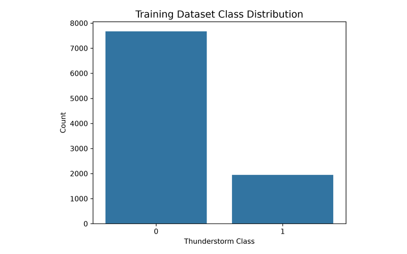
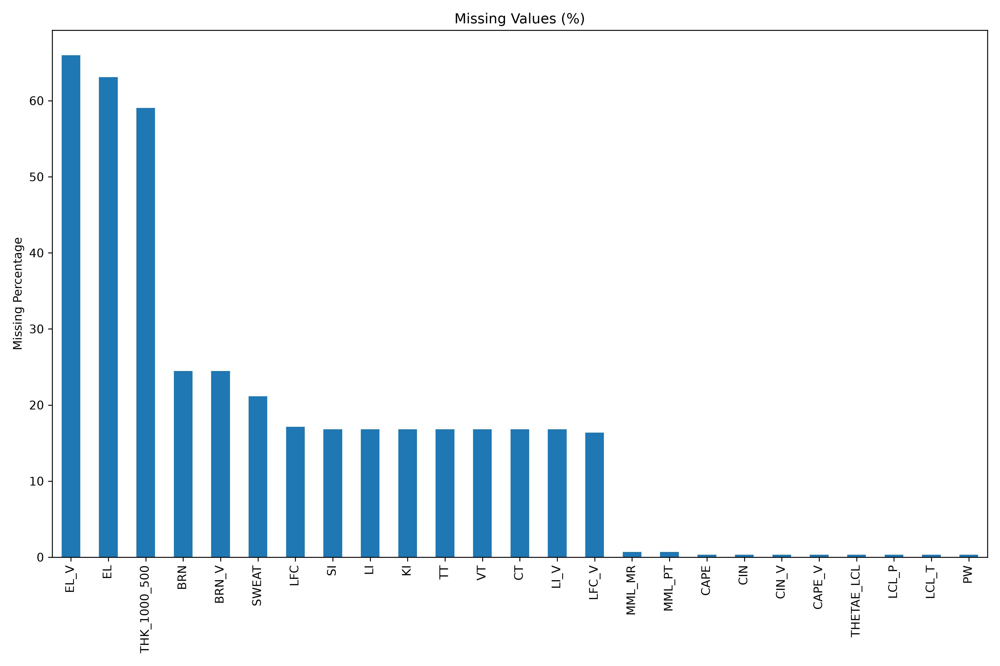
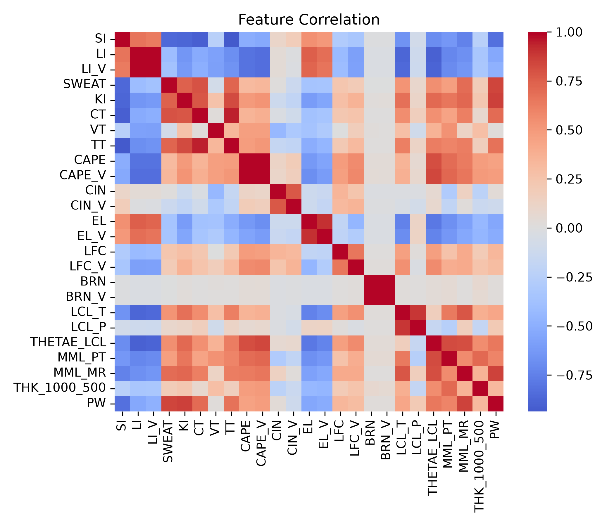
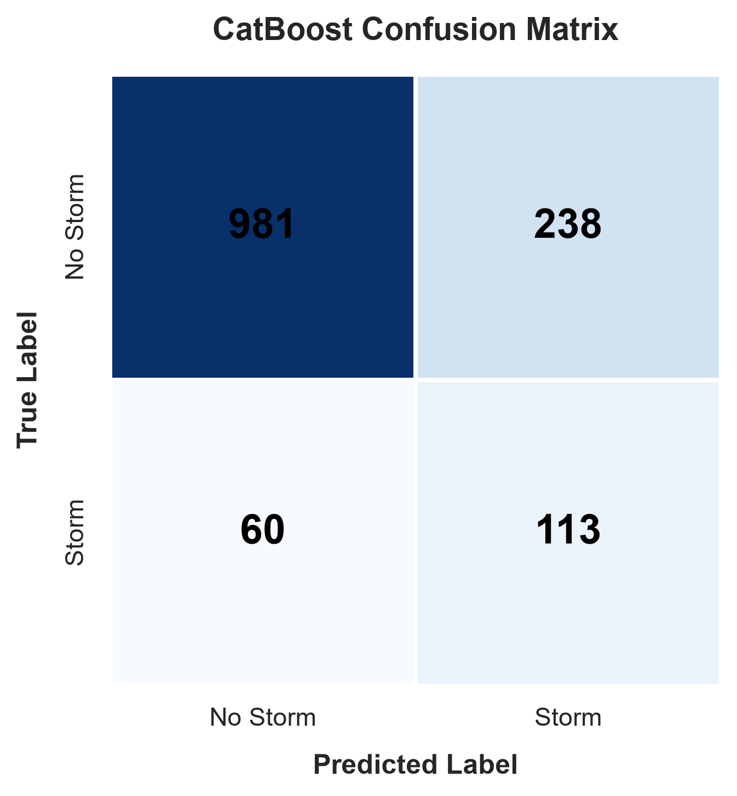
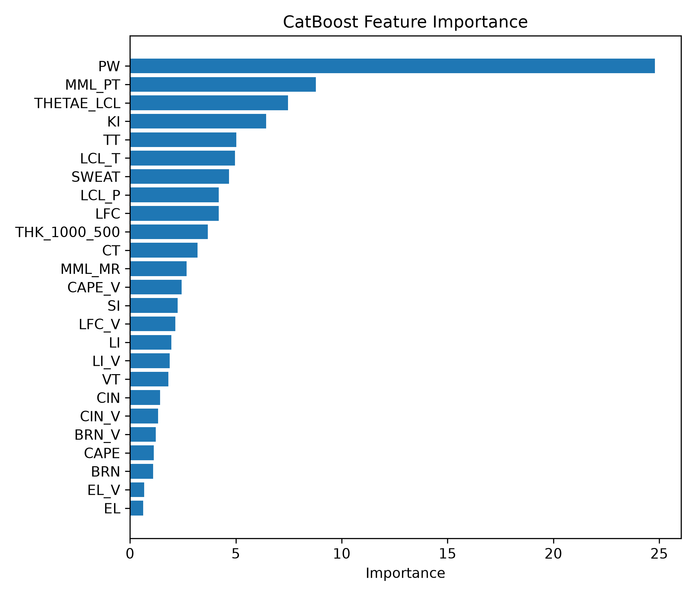
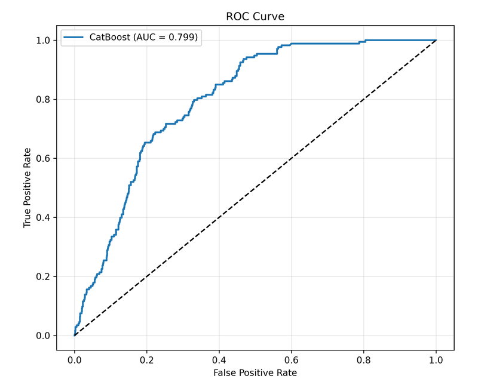
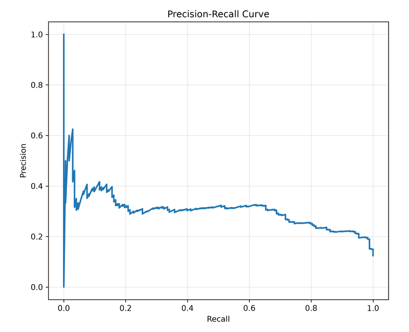
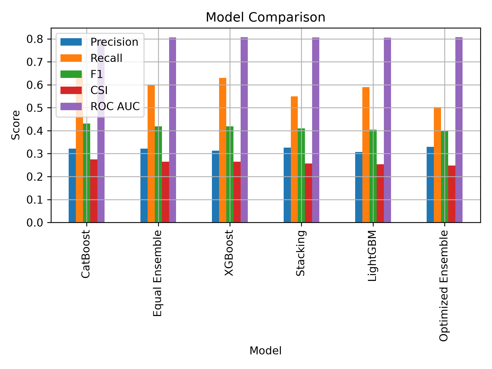

# ⚡ Real-Time Thunderstorm Prediction System

[](https://www.python.org/)
[](https://streamlit.io/)
[](https://catboost.ai/)
[](https://unidata.github.io/MetPy/latest/)
[](LICENSE)

> **Operational Machine Learning System for 24-Hour Convective Hazard Forecasting Using Upper-Air Radiosonde Soundings, Derived Thermodynamic Indices, and Automated Wyoming Sounding Data Ingestion.**

---

## 📌 Repository Overview

The **Real-Time Thunderstorm Prediction System** is an operational machine learning framework designed to classify and predict 24-hour thunderstorm occurrence for **Station 43150 (Visakhapatnam, India; 17.70° N, 83.30° E)**.

By combining **25 annual cycles of radiosonde upper-air profiles (2000–2025)** with ground-truth SYNOP present-weather reports, the system computes **28 atmospheric stability, moisture, and kinematic indices** via MetPy and predicts next-day severe weather risk using an Optuna-optimized **CatBoost Classifier**. The deployed Streamlit dashboard fetches live upper-air soundings via Siphon from the University of Wyoming database and maps raw probabilities into **7 calibrated operational risk tiers (35% to 95%)**.

---

## 🚀 Key Features

* **⚡ Real-Time Sounding Ingestion**: Automated live upper-air radiosonde retrieval for Station 43150 (00:00 & 12:00 UTC) via `Siphon` from the University of Wyoming database, with fallback to historical observations.
* **🔬 MetPy Diagnostic Engine**: Dynamic calculation of 28 atmospheric stability, thermodynamic, and kinematic indices (CAPE, PW, K-Index, Lifted Index, SWEAT, BRN, etc.).
* **🤖 Optimized Gradient-Boosted Classifier**: Deployed CatBoost model with ordered boosting and oblivious trees, natively handling missing sounding levels without imputation bias.
* **🎯 Recall-Constrained Threshold Calibration**: Decision threshold (0.32) optimized against the Critical Success Index (CSI) to prioritize early hazard warning over false alarm reduction.
* **📊 Operational Risk Scale**: Calibrated probability mapping converting raw model outputs into 7 actionable risk levels (*Very Low* to *Very High*).
* **🎨 Executive Dashboard**: Interactive Streamlit interface displaying station metadata, thermodynamic index cards, model predictions, risk progress bars, Plotly feature importances, and downloadable raw sounding data.

---

## 📊 Dataset & Ground Truth

| Parameter | Description |
| :--- | :--- |
| **Observation Station** | Station 43150 (Visakhapatnam, India; 17.70° N, 83.30° E) |
| **Time Period** | 25 Years (2000 – 2025), total 11,591 atmospheric soundings |
| **Data Sources** | 1. University of Wyoming Upper-Air Radiosonde Archive<br>2. SYNOP Present/Past Weather Reports (`7wwW1W2` codes) |
| **Target Variable (`Thunderstorm_24h`)** | Binary indicator (1 = Thunderstorm observed within 24h, 0 = Non-thunderstorm). Triggered by present weather (ww in 13, 17, 29, 91-99) or past weather (W1/W2 = 9). |
| **Class Distribution** | Imbalanced: 79.78% non-thunderstorm vs. 20.22% thunderstorm soundings |

### 📅 Chronological Dataset Splitting
To mirror operational forecasting reality and prevent temporal autocorrelation leakage:
* **Training Set (2000–2020)**: 9,619 soundings used for model parameter fitting.
* **Validation Set (2021–2022)**: 580 soundings reserved for hyperparameter tuning & threshold selection.
* **Testing Set (2023–2025)**: 1,392 soundings held out for final unbiased evaluation.

<p align="center">
  
  
</p>

---

## 🌡️ Atmospheric Stability & Derived Features

The model utilizes **28 upper-air predictors** calculated using the `MetPy` atmospheric science library:

| Symbol | Parameter | Meteorological Significance |
| :--- | :--- | :--- |
| **PW** | Precipitable Water | Total column water vapour; primary moisture reservoir for deep convection. |
| **KI** | K-Index | Combines 850-500 hPa lapse rate and moisture at 850/700 hPa; signals air-mass storms. |
| **LI / LI_V** | Lifted Index (Standard & Virtual) | Environment minus parcel temperature at 500 hPa; negative values indicate instability. |
| **TT / CT / VT**| Totals Totals, Cross Totals, Vertical Totals | Static lapse rate & moisture contribution to convective instability. |
| **CAPE / CAPE_V**| Convective Available Potential Energy | Integrated positive buoyant energy between LFC and EL (updraft fuel). |
| **CIN / CIN_V** | Convective Inhibition | Energy barrier suppressing parcel ascent before reaching LFC. |
| **SWEAT** | Severe Weather Threat Index | Combines low/mid-level shear, wind speed, and moisture for severe convection. |
| **BRN / BRN_V** | Bulk Richardson Number | Ratio of CAPE to vertical wind shear; identifies storm organization mode. |
| **LCL_P / LCL_T**| Lifted Condensation Level | Pressure and temperature at which a rising parcel saturates (cloud base). |
| **THETAE_LCL** | Equivalent Potential Temp at LCL | Conserved moist thermodynamic potential temperature. |
| **THK_1000_500**| 1000–500 hPa Thickness | Geopotential thickness proportional to mean-layer virtual temperature. |

<p align="center">
  
</p>

---

## ⚙️ Machine Learning Pipeline & Methodology

1. **Data Acquisition & Labeling**: Paired 25 years of upper-air radiosonde soundings for Station 43150 with surface SYNOP weather reports to construct ground-truth thunderstorm labels.
2. **Diagnostic Feature Engineering**: Computed 28 thermodynamic, stability, and kinematic indices per sounding using the `MetPy` library.
3. **Chronological Splitting**: Partitioned data by year into Training (2000–2020), Validation (2021–2022), and Test (2023–2025) sets to prevent temporal data leakage.
4. **Model Development**: Trained CatBoost, LightGBM, XGBoost, and multi-model voting/stacking ensembles.
5. **Hyperparameter Optimization**: Tuned models using Optuna (Tree-structured Parzen Estimator) for optimal validation AUC and F1-score.
6. **Threshold Calibration**: Swept decision thresholds to maximize Critical Success Index (CSI) with a minimum 0.70 recall floor, establishing 0.32 as the operational threshold.
7. **Operational Deployment**: Built a Streamlit web application with automated live Wyoming sounding fetching and 7-tier risk category mapping.

---

## 📈 Model Performance & Visualizations

Evaluated on the held-out **2023–2025 test set** (1,392 unseen soundings):

### 🎯 CatBoost Performance & Confusion Matrix

<p align="center">
  
  
</p>

* **True Negatives (TN)**: 981
* **False Positives (FP)**: 238
* **False Negatives (FN)**: 60 (Missed storms)
* **True Positives (TP)**: 113 (Detected storms)

### 📊 Performance Curves (ROC & Precision-Recall)

<p align="center">
  
  
</p>

### ⚔️ Algorithm & Ensemble Performance Comparison

<p align="center">
  
</p>

| Model / Ensemble Strategy | ROC AUC | Recall (POD) | Precision | CSI (Threat Score) | F1-Score |
| :--- | :---: | :---: | :---: | :---: | :---: |
| **CatBoost (Selected Operational)** | **0.799** | **0.653** | **0.322** | **0.275** | **0.431** |
| LightGBM | 0.805 | 0.613 | 0.307 | 0.260 | 0.409 |
| XGBoost | 0.807 | 0.630 | 0.313 | 0.265 | 0.418 |
| Equal Voting Ensemble | 0.805 | 0.589 | 0.326 | 0.265 | 0.420 |
| Weighted Ensemble (0.1 CB, 0.35 LGB, 0.55 XGB) | 0.807 | 0.503 | 0.330 | 0.249 | 0.398 |
| Stacking Ensemble (Logistic Regression Meta) | 0.805 | 0.555 | 0.328 | 0.258 | 0.412 |

> **Why CatBoost was selected**: CatBoost achieved the highest operational hazard detection recall (65.3%) and Critical Success Index (0.275) among all individual models and ensembles. In severe weather forecasting, missed events carry significantly higher cost than false alarms.

---

## 🚦 Operational Probability Thresholds

Raw model probabilities are mapped into 7 operational risk tiers based on atmospheric instability thresholds:

| Operational Probability | Risk Category | Key Index Threshold Highlights |
| :---: | :--- | :--- |
| **95%** | **Very High** | PW >= 60.5 mm, KI >= 35.6, CAPE_V >= 2325 J/kg, SWEAT >= 223.4 |
| **85%** | **High** | PW >= 55.4 mm, KI >= 34.1, CAPE_V >= 2196 J/kg, SWEAT >= 216.2 |
| **75%** | **Moderately High**| PW >= 50.6 mm, KI >= 32.9, CAPE_V >= 1799 J/kg, SWEAT >= 215.8 |
| **65%** | **Moderate** | PW >= 41.6 mm, KI >= 26.8, CAPE_V >= 1541 J/kg, SWEAT >= 157.5 |
| **55%** | **Moderately Low** | PW >= 29.4 mm, KI >= 16.4, CAPE_V >= 977 J/kg, SWEAT >= 83.4 |
| **45%** | **Low** | PW >= 22.5 mm, KI >= -10.6, CAPE_V >= 56 J/kg, SWEAT >= 59.4 |
| **<35%**| **Very Low** | PW < 22.5 mm, KI < -10.6, CAPE_V < 56 J/kg |

---

## 📁 Project Directory Structure

```text
Real-Time-Thunderstorm-Prediction/
├── .streamlit/
├── final_outputs/                            # Production model artifacts & probability mappings
│   ├── CatBoost_Final.pkl
│   ├── feature_order.pkl
│   ├── feature_importance.pkl
│   ├── CatBoost_Operational_Probability_Mapping.csv
│   └── CatBoost_Operational_Thunderstorm_Thresholds.csv
├── catboost/                                 # CatBoost model training & evaluation pipeline
│   ├── data/
│   ├── models/
│   ├── notebooks/
│   └── results/
├── other_models/                             # Comparative models (LightGBM, XGBoost, Ensemble)
│   ├── lightgbm/
│   ├── xgboost/
│   └── ensemble/
├── app.py                                    # Streamlit real-time dashboard UI
├── predict.py                                # Inference pipeline module
├── fetch_latest.py                           # Live Wyoming sounding data fetcher
├── metpy_indices.py                          # Sounding index calculation engine
├── requirements.txt                          # Project dependencies
└── Thunderstorm_Report_Final.pdf             # Internship technical report
```

---

## 🛠️ Installation & Setup Guide

### 1. Prerequisites
Ensure you have Python 3.9+ installed on your system.

### 2. Clone Repository
```bash
git clone https://github.com/Sankhyaan/Real-Time-Thunderstorm-Prediction.git
cd Real-Time-Thunderstorm-Prediction
```

### 3. Create Virtual Environment
```bash
python -m venv venv
# On Windows:
venv\Scripts\activate
# On Linux/macOS:
source venv/bin/activate
```

### 4. Install Dependencies
```bash
pip install -r requirements.txt
```

### 5. Run Streamlit Dashboard
```bash
streamlit run app.py
```
Open [http://localhost:8501](http://localhost:8501) in your web browser.

---

## 👨‍💻 Author & Acknowledgements

* **Project Developer**: Internship Project at **India Meteorological Department (IMD)**.
* **Data Sources**: 
  * Atmospheric Radiosonde Soundings: **University of Wyoming Department of Atmospheric Science**.
  * Surface SYNOP Present/Past Weather Observations: **India Meteorological Department (IMD)**.
* **Libraries Used**: `MetPy`, `Siphon`, `CatBoost`, `LightGBM`, `XGBoost`, `Optuna`, `Streamlit`, `Plotly`, `Pandas`, `Scikit-Learn`.